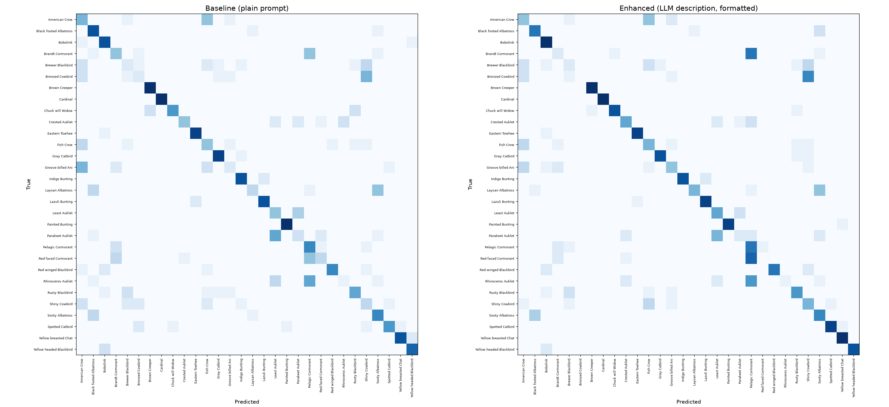

# Zero-Shot Fine-Grained Bird Classification with LLM-Generated Semantic Descriptions

ITSOLERA ML Internship 3rd project. Investigates whether an LLM can automatically generate class-discriminative visual descriptions that improve zero-shot image classification, replacing manually annotated attributes.

## Overview

Zero-shot image classification (ZSIC) recognizes categories a model has never seen labeled examples of, by transferring knowledge from auxiliary semantic information. Existing methods rely on manually built attributes or embeddings, which are costly to construct and often too generic for fine-grained categories. This project tests an LLM-assisted alternative: Gemini generates class-level visual descriptions automatically, which are then used as CLIP text prompts and compared against a plain class-name baseline.

## Dataset

A 30-class subset of CUB-200-2011, chosen for fine-grained difficulty rather than at random. The subset includes several visually similar groups (albatrosses, auklets, blackbirds, buntings, cormorants, cowbirds, crows), which is where most classification failures occur. Evaluation uses the official CUB test split, capped at 15 images per class (445 images total). The full 200-class dataset is not evaluated.

## Method

**Model:** CLIP ViT-B/32 (OpenAI pretrained weights), used purely for zero-shot inference — no training or fine-tuning.

**Class selection:** first 30 classes from `CUB_200_2011/images` after sorting folder names.

**LLM descriptions:** five short visual descriptions per class (plumage colour, bill shape, body size, distinctive markings), generated by `gemini-3.5-flash-lite` and saved to `class_descriptions.json`. The generation script resumes from existing progress, saves after every class, and retries on rate limits.

Two ways of encoding the descriptions were tested:

- **Raw:** descriptions passed directly to the CLIP tokenizer.
- **Caption-formatted:** descriptions wrapped in a caption-style template ("a photo of a {class}, which {description}") before encoding, to better match CLIP's training distribution.

## Results

| Condition | Correct | Accuracy | Change vs. baseline |
|---|---:|---:|---:|
| Baseline — plain class-name prompt | 259/445 | 58.20% | — |
| Raw LLM descriptions | 179/445 | 40.22% | −17.98 pp |
| Caption-formatted LLM descriptions | 276/445 | 62.02% | +3.82 pp |



Prompt format matters as much as the content. Literary phrasing in the raw descriptions moves CLIP's text embeddings away from the region it was trained on (image alt-text and captions), which is why the same descriptions hurt accuracy in raw form and helped once reformatted as captions.

## Failure analysis

**Cormorants.** Descriptions for Brandt's, Red-faced, and Pelagic Cormorant all lean on the same generic language — dark plumage, iridescence, breeding-season plumes — so the three classes became harder to tell apart rather than easier. Accurate descriptions, but not discriminative ones.

**Cowbirds.** Same pattern: Bronzed and Shiny Cowbird descriptions both emphasize glossy, iridescent, dark plumage and red eyes, and the two classes were repeatedly confused.

**What worked.** Spotted Catbird (green plumage, strong white spotting, ivory bill), Groove-billed Ani (ridged bill), and Brown Creeper (bark-patterned upperparts, downcurved bill, stiff tail) all improved substantially — their descriptions repeatedly anchored on a feature rare or unique among the 30 classes rather than one shared across a whole species group.

**Guideline:** LLM-generated descriptions help most when phrased in caption-like language and when they name a feature unique to a class among its close relatives. They hurt when the LLM defaults to generic, family-level language that multiple sibling species share.

## Pipeline

| Phase | Script | Output |
|---|---|---|
| 1 — Dataset prep | `phase1_dataset.py` | class subset selection |
| 2 — Baseline | `phase2_baseline.py` | `baseline_results.json` |
| 3 — Description generation | `phase3_descriptions.py` | `class_descriptions.json` |
| 4 — Enhanced classification | `phase4_enhanced.py` | `enhanced_results.json` |
| 5 — Analysis | `phase5_analysis.py` | `per_class_comparison.json`, `confusion_matrices.png` |

## Repository structure

```
phase1_dataset.py
phase2_baseline.py
phase3_descriptions.py
phase4_enhanced.py
phase5_analysis.py

baseline_results.json
class_descriptions.json
enhanced_results.json
per_class_comparison.json
confusion_matrices.png

ZSIC_Final_Report.docx
README.md
.gitignore
```

CUB-200-2011 and the local virtual environment are excluded via `.gitignore`.

## Requirements

Python 3.x, PyTorch, `open_clip`, Pillow, `google-genai`, NumPy, Matplotlib, scikit-learn.

```
pip install torch torchvision open_clip_torch google-genai pandas numpy scikit-learn matplotlib pillow
```

Requires a `GEMINI_API_KEY` environment variable to regenerate descriptions. On PowerShell:

```powershell
$env:GEMINI_API_KEY="your_api_key"
```

Never commit an API key to GitHub.

CUB-200-2011 must be downloaded separately from the [Caltech dataset page](https://www.vision.caltech.edu/datasets/cub_200_2011/) and extracted into `CUB_200_2011/` at the repo root.

## Running the project

```powershell
.\zsic_env\Scripts\Activate.ps1
python phase1_dataset.py
python phase2_baseline.py
python phase3_descriptions.py
python phase4_enhanced.py
python phase5_analysis.py
```

If `class_descriptions.json` already has completed descriptions, Phase 3 resumes rather than regenerating them.

## Limitations

Only 30 of 200 CUB classes and 445 test images are evaluated. Only CLIP ViT-B/32 is tested, without fine-tuning. LLM descriptions were not validated by an ornithology expert, and several contain generic features shared across closely related species. No harmonic mean of seen/unseen accuracy was computed. The caption-formatting strategy was chosen empirically from this experiment rather than derived from a general rule.

## Future work

Extend to the full CUB-200-2011, AWA2, and SUN. Improve description generation with contrastive prompts that explicitly compare a class against its closest relatives, and filter out generic descriptions before use. Compare against other vision-language models beyond CLIP ViT-B/32. Test robustness under domain shift. Validate LLM descriptions against expert-created attributes.

## Reference

Xu, S., Wang, Y., Zhu, X., et al. "A Survey of Zero-Shot Image Classification: Concepts, Developments, and Challenges." *Tsinghua Science and Technology*, 2026, 31(6), 2792–2821. https://doi.org/10.26599/TST.2025.9010131

Gemini API model and deprecation info: https://ai.google.dev/gemini-api/docs/models, https://ai.google.dev/gemini-api/docs/deprecations

## Conclusion

A plain-prompt CLIP baseline reached 58.20% on 30 fine-grained bird classes. Raw LLM-generated descriptions dropped accuracy to 40.22%; the same descriptions reformatted as captions raised it to 62.02%, a 3.82-point improvement over baseline. LLM-generated auxiliary information is useful for fine-grained zero-shot classification when it is specific enough to distinguish classes and phrased in a way compatible with the vision-language model's text representation — generic or poorly formatted descriptions can hurt more than they help.
